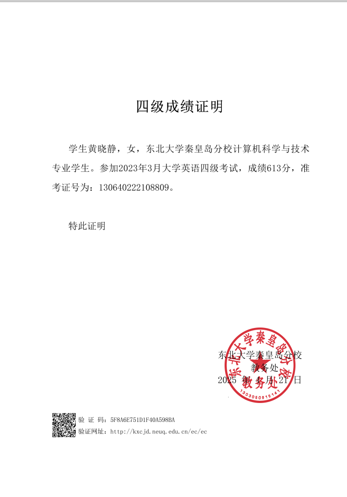
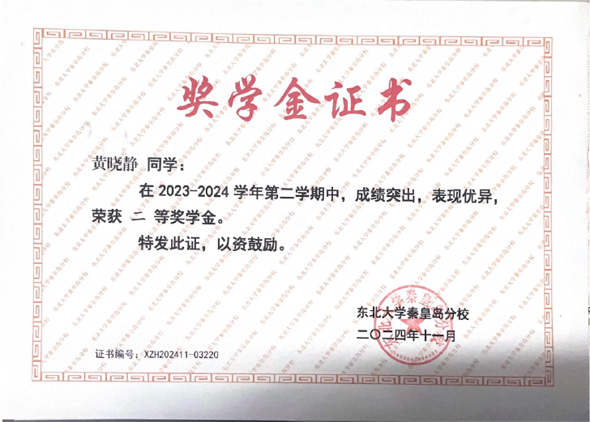
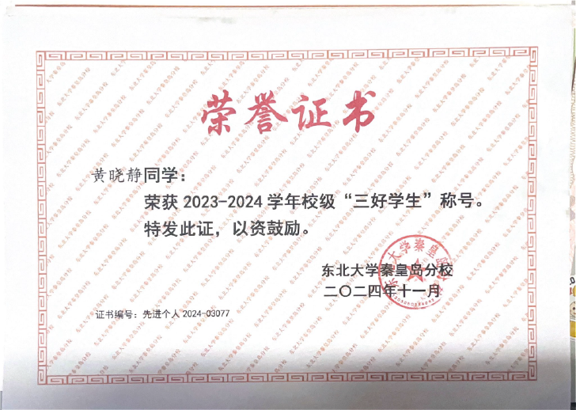
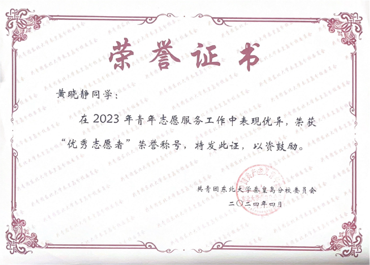
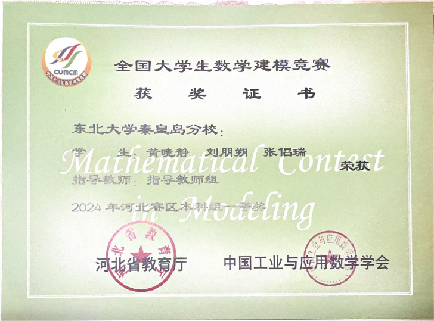

<!DOCTYPE html>
<html lang="zh">
<head>
  <meta charset="UTF-8" />
  <meta name="viewport" content="width=device-width, initial-scale=1.0" />
  <title>黄晓静 - 个人简历</title>
  
</head>
<body>

<h1>个人情况介绍</h1>
<h2>基本信息</h2>
<table>
<tr>
<td width="60%">
<ul>
  <li><strong>姓名</strong>：黄晓静</li>
  <li><strong>学校</strong>：东北大学（秦皇岛）</li>
  <li><strong>专业</strong>：计算机科学与技术</li>
  <li><strong>年级</strong>：2022级</li>
  <li><strong>电话</strong>：19565385900</li>
  <li><strong>邮箱</strong>：19565385900@163.com</li>
</ul>
</td>
<td width="40%" class="center">
  
</td>
</tr>
</table>

<h2>📊 学业成绩</h2>
<h3>GPA与排名</h3>
<ul>
  <li><strong>GPA</strong>：4.31/5.0（专业前1.5%）</li>
  <li><strong>核心课程成绩</strong>：
    <ul>
      <li>高等数学 100/100</li>
      <li>离散数学 100/100</li>
      <li>线性代数 99/100</li>
      <li>C++程序设计 99/100</li>
      <li>数据结构与算法：98/100</li>
      <li>数据库原理：98/100</li>
      <li>操作系统：95/100</li>
    </ul>
  </li>
  <li><strong>英语水平</strong>：CET4 613，CET6 522</li>
</ul>

  
  
  

<h2>🔬 科创经历</h2>
<!-- 各项目内容保持不变 -->
<!-- 因字数限制此处略去项目内容，但你可继续从 "项目1" 开始依次转换 HTML -->

<h2>🏆 个人荣誉</h2>
<table border="1">
  <tr><th>奖项名称</th><th>颁发单位</th><th>时间</th></tr>
  <tr><td>校综合二等奖学金*3</td><td>东北大学秦皇岛分校</td><td>2023.10 2024.05 2024.11</td></tr>
  <tr><td>校综合三等奖学金</td><td>东北大学秦皇岛分校</td><td>2023.05</td></tr>
  <tr><td>优秀学生干部</td><td>东北大学秦皇岛分校</td><td>2023.11</td></tr>
  <tr><td>优秀团干部标兵</td><td>东北大学秦皇岛分校</td><td>2023.11</td></tr>
  <tr><td>三好学生</td><td>东北大学秦皇岛分校</td><td>2024.11</td></tr>
  <tr><td>优秀志愿者</td><td>共青团东北大学秦皇岛分校委员会</td><td>2024.04</td></tr>
</table>

  
  
  
  
  
  

<h2>🏆 竞赛荣誉</h2>
<table border="1">
  <tr><th>奖项名称</th><th>颁发单位</th><th>时间</th></tr>
  <tr><td>全国大学生数学建模竞赛省级一等奖</td><td>中国工业与应用数学学会</td><td>2025.09</td></tr>
  <tr><td>国际大学生数学竞赛H奖</td><td>美国数学及其应用联合会</td><td>2024.05</td></tr>
  <tr><td>亚太地区大学生数学建模竞赛国家级三等奖</td><td>亚太地区大学生数学建模竞赛组委会</td><td>2025.01</td></tr>
  <tr><td>全国大学生数学竞赛省级三等奖</td><td>东北大学秦皇岛分校</td><td>2023.11</td></tr>
</table>

  
  
  

<h2>📌 其他技能</h2>
<ul>
  <li><strong>编程语言</strong>：Python（熟练）、C++、Java</li>
  <li><strong>工具框架</strong>：PyTorch、TensorFlow、MySQL</li>
  <li><strong>硬件设计能力</strong>：Vivado</li>
</ul>

</body>
</html>
